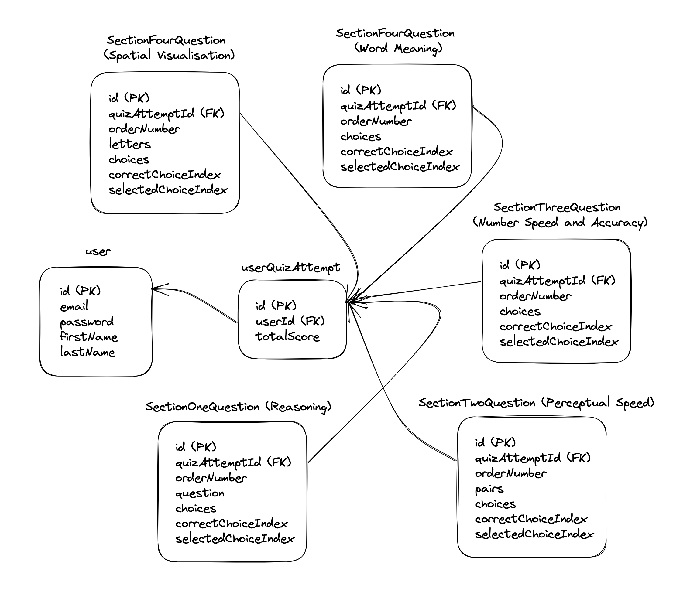
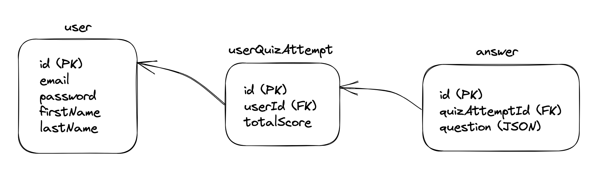

# Brief

API for gia-trainer using Express.js

### Starting MySQL Server on my local machine (Mac OS)

root user access:

```
mysql -u root -p
```

"no-user" access:

```
mysql
```

### TODOs:

- [ ] consider adding dist folder to .gitIgnore
- [ ] add tests for all API endpoints to postman
- [ ] install and configure nginx for handling https requests from the vercel app, or try letsencrypt for generating a ssl/tls certificate. see this: https://betterprogramming.pub/setup-nginx-for-your-nodejs-server-on-ec2-ae46a3d0cb1b
- [ ] remove questions.json from git!!! answers are out there for public to see!
- [ ] block public access to /quizQuestions (mayber provide a subset of all questions for visitors) because answers are leaked.

### DB Schemas

The following diagrams illustrate two options for storing app data, specifically quiz attempt data. I have chosen to adopt **option 2** because of it's simplicity. However, if querying/indexing or data integrity and validation are issues, migrating to **option 1** should be considered.

_Option 1:_


_Option 2:_


### Stack

- **MySQL** for database management (hosting with AWS RDS).
- **bcrypt** for hashing passwords.
- **jwt** for authenticaing requests that require verification.
- **Zerossl** for ssl certification generation
- **express js** for serving api
- **nginx** for being the reverse proxy

### Connecting to server on AWS EC2 instance:

### Important commands:

Open bash config file

```
sudo vim ~/.bashrc
```

Make sure to reload the configuration with `source ~/.bashrc` after saving any changes.

Build TS to JS files for deployment

```
npm run build
```

Start server from inside dist folder

```
pm2 start index.js
```

See the error logs for all processes

```
pm2 logs
```

See the error logs for a specific process

```
pm2 logs <process_name_or_id> --error
```

Clear logs

```
pm2 flush
```

Stop process

```
pm2 delete
```

Connect to ec2 instance

```
ssh -i "aws-key.pem" ec2-user@ec2-13-40-222-178.eu-west-2.compute.amazonaws.com
```

List installed packages

```
apt list --installed
```

Restart nginx

```
sudo systemctl restart nginx
```

Get nginx error log

```
sudo tail -f /var/log/nginx/error.log
```

Test nginx config file is valid

```
sudo nginx -t
```

List port forwarding rules

```
sudo iptables -t nat --line-numbers -n -L
```

Remove port forwarding rule

```
sudo iptables -t nat -D PREROUTING <rule_number>
```

Add port forwarding rule

```
sudo iptables -t nat -A PREROUTING -p tcp --dport 80 -j REDIRECT --to-ports 5000
```

Transfer file to ec2 instance

```
scp -i <ssh_key_path> <sending_file_path> ubuntu@3.145.91.237:
```

### Alias Commands

```
open_nginx_config_gt
```

```
nginx_reload
```

```
build_web_server_gt
```

```
start_web_server_gt
```
